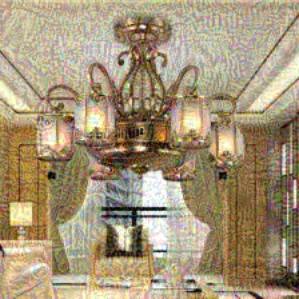
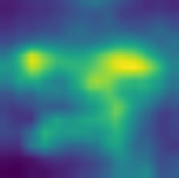
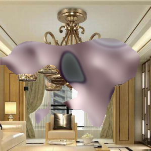
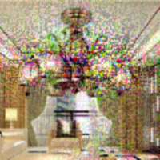

# Defense [IJCAI-2019 Alibaba Adversarial AI Challenge (AAAC 2019)](https://tianchi.aliyun.com/markets/tianchi/ijcai2019))

## Introduction

 The original neural network is very vulnerable to attack. The general defense method is to design a denoising method of filtering images or feature maps to reduce the impact of attack. In practice, the denoising method has certain limitations, such as the inability to process images which miss key areas. We propose a novel method composed multiple image domain transformations which can defend most of the black-box adversarial attacks. The image domain transformations include image multi-scale space representation, edge-preserving filtering and adversarial complementary learning of significant area mask. These three types of transformations defend against completely different attack methods. Compared to most current defense methods, the proposed method is very robust. The project based on our method placed second in recent IJCAI-2019 Alibaba Adversarial AI Challenge (AAAC 2019)).

这是IJCAI-19 阿里巴巴人工智能对抗算法竞赛防御赛道排名第二的方案．

原始的神经网络非常容易受到攻击。一般防御方法是设计一种针对图像或特征图的去噪方法，以减少攻击的影响。在实践中，这类去噪方法具有某些限制，例如很难处理关键区域被遮挡的图像。我们提出了一种新的方法，包含多个图像域变换，可以防御大多数黑盒对抗攻击。这些图像域变换包括图像多尺度空间表示，边缘保留滤波和关键区域遮挡的对抗性互补学习。这三种类型的转换可以抵御完全不同的攻击方法。与大多数当前的防御方法相比，我们所提出的防御框架非常鲁棒。

## Prerequisites

~~~
scipy==1.2.0
opencv_python==3.2.0.8
tensorflow_gpu==1.1.0
numpy==1.15.4
Pillow==6.0.0
~~~

## Domain Transform

  

#### Gauss filter

  

#### Edge preserving filter

  

#### GradCAM 

  

 